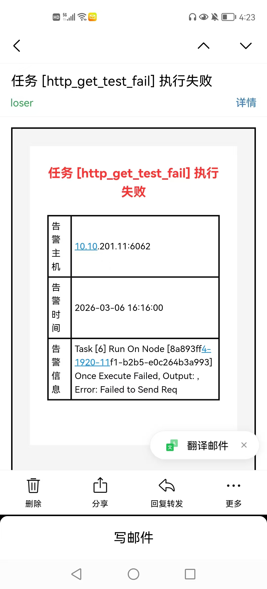
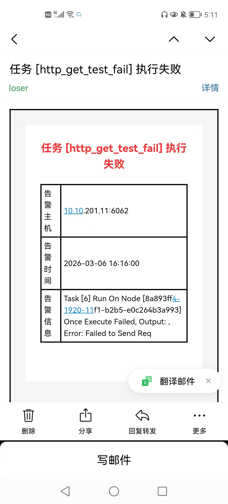

# TaskGo


## 1. 项目介绍

### 1.1 项目背景

项目组或者实验室以及个人开发者可能有一些定时任务的需求, 比如项目的定时启动、模型训练推理等, 如果仅仅只是使用 Linux Crontab 表达式可能造成定时任务失败难以管理以及任务失败难以回溯等问题, 所以我开发了 TaskGo 定时任务平台, 用于定时任务的统一管理和调度

### 1.2 项目介绍

TaskGo 是一个使用 Go + Etcd + Mysql 开发的一个分布式定时任务平台, 支持多节点部署, 支持节点故障转移, 任务自动分配以及任务失败、节点失活情况下的回调通知等功能

## 2. 功能特性

TaskGo 目前支持如下功能:

- 任务节点多节点部署
- 采用 master-slave 架构, 实现 slave 宕机时任务自动转移
- 支持 shell 和 http 回调任务
- 支持任务的自动分配以及手动分配
- 定时任务失败邮件通知回调
- 节点时活邮件通知回调
- 提供管理端, 实现用户管理、任务管理、任务日志管理、节点状态检测等功能

## 3. 基本使用

### 3.1 环境要求

- 安装 etcd、mysql 环境(可以使用 docker 部署)
- golang >= 1.25.5

### 3.2 使用步骤

这里通过编译源码的方式来使用:

```shell
cd TaskGo

# 编译 admin 和 node
make build

# 使用默认配置启动 admin 节点
make run_admin

# 使用默认配置启动 node 节点
make run_admin
```

> **同时需要注意在启动节点之前, 需要修改配置文件, 比如需要修改发送邮件需要的 secret key 改为自己的**

启动 admin 节点之后, 对应的 api server 会监听 8088 端口, 本项目暂时没有提供前端页面, 只提供了 API 接口, 可以参考: [TaskGo 接口文档.md](./docs/TaskGo接口文档)

## 4. 项目截图

节点失活告警:



任务失败告警:




## 5. TODO

- [ ] 开发Admin前端
- [ ] 支持 grpc 回调任务、微服务框架服务调用任务

## 6. 感谢

这一个项目收到如下开源项目的启发:

- https://github.com/shunfei/cronsun
- https://github.com/robfig/cron

- https://github.com/tmnhs/Crony/tree/master


